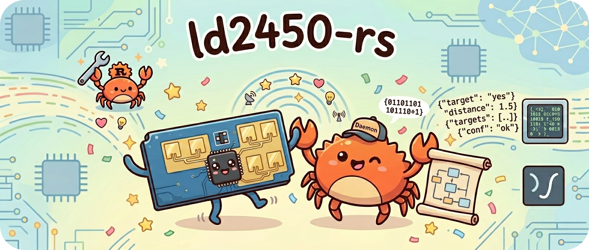
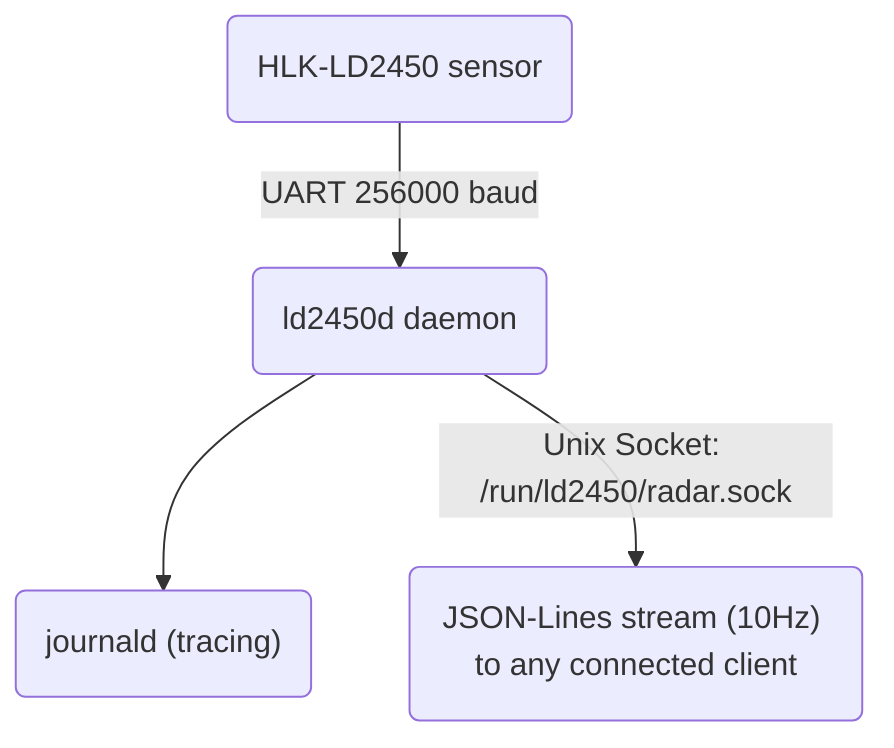
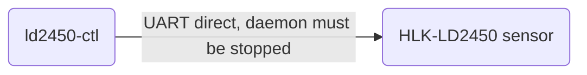

<p align="center">
  
  <br><br>
  <strong>A lean Rust microservice for the HLK-LD2450 24 GHz mmWave radar sensor on Linux.</strong>
  <br><br>
  
  
  
</p>

---

The daemon reads the sensor over UART and streams parsed target data as JSON-Lines over a Unix domain socket. A separate CLI tool handles sensor configuration. The protocol library is `no_std`-compatible.

## Architecture

### Daemon

### CLI Tool
One-shot CLI for sensor


## Crates

| Crate          | Description                                                                                                  | |
| -------------- | ------------------------------------------------------------------------------------------------------------ | --- |
| `ld2450-proto` | Protocol library: zero-alloc frame parser (state machine), command builder, ACK parser. `no_std`-compatible. | [](https://crates.io/crates/ld2450-proto) [](https://docs.rs/ld2450-proto) |
| `ld2450d`      | Streaming daemon: reads UART, parses frames, broadcasts JSON over Unix socket.                               | |
| `ld2450-ctl`   | CLI configuration tool: all sensor commands without a running daemon.                                        | |

## Sensor Data Format

The daemon emits one JSON line per radar frame (10 Hz). Only active targets are included:

```json
{
  "ts": 1744489123.456,
  "targets": [
    {
      "x": -0.782,
      "y": 1.713,
      "speed": -0.16,
      "dist": 1.888,
      "angle": -24.7
    }
  ]
}
```

| Field   | Unit           | Description                                      |
| ------- | -------------- | ------------------------------------------------ |
| `ts`    | seconds (Unix) | Timestamp                                        |
| `x`     | metres         | Horizontal position (+ right, − left of sensor)  |
| `y`     | metres         | Distance in front of sensor (always positive)    |
| `speed` | m/s            | Radial speed (+ approaching, − receding)         |
| `dist`  | metres         | Euclidean distance from sensor                   |
| `angle` | degrees        | Angle from boresight (−60 to +60)                |

Up to **3 targets** can be tracked simultaneously.

## Quick Start

### Requirements

- Rust 1.74+ (or install via [rustup](https://rustup.rs/))
- A serial port connected to an HLK-LD2450 sensor
- Linux (any architecture; tested on x86_64 and aarch64)

### Build

```bash
cargo build --release
```

Produces two binaries in `target/release/`:

- `ld2450d` -- the streaming daemon
- `ld2450-ctl` -- the configuration CLI

### Configuration

The daemon works out of the box with sensible defaults. A config file is **optional** --
if none is found, the following defaults are used:

| Setting       | Default                  |
| ------------- | ------------------------ |
| `device`      | `/dev/ttyAMA0`           |
| `baud_rate`   | `256000`                 |
| `socket_path` | `/run/ld2450/radar.sock` |
| `log_level`   | `info`                   |

To override any setting, create a TOML config file:

```toml
device = "/dev/ttyUSB0"       # Adjust to your serial device
baud_rate = 256000
socket_path = "/run/ld2450/radar.sock"
log_level = "info"
```

Common serial device paths:

- `/dev/ttyAMA0` -- Raspberry Pi GPIO UART
- `/dev/ttyUSB0` -- USB-to-serial adapters
- `/dev/ttyACM0` -- CDC ACM devices

### Run

```bash
# Run with defaults (no config file needed)
ld2450d

# Run with explicit config
ld2450d /path/to/config.toml

# Override log level via environment
RUST_LOG=debug ld2450d
```

Connect a client to read the stream:

```bash
socat - UNIX-CONNECT:/run/ld2450/radar.sock
```

## Deployment

### Cross-Compilation

```bash
# Install cross (Docker-based cross-compiler)
cargo install cross

# Build for aarch64
cross build --target aarch64-unknown-linux-gnu --release
```

Or use the provided [justfile](https://github.com/casey/just):

```bash
just build                                    # default: aarch64-unknown-linux-gnu
TARGET=x86_64-unknown-linux-gnu just build    # override target
```

### Pre-built Binaries

Pre-built binaries for x86_64 and aarch64 Linux are available on the
[Releases](https://github.com/duramson/ld2450-rs/releases) page.

### systemd

Copy the provided unit files to the target system:

```bash
cp deploy/ld2450d.service /etc/systemd/system/
cp deploy/ld2450d.tmpfiles /etc/tmpfiles.d/ld2450d.conf

# Create runtime directory
systemd-tmpfiles --create

# Edit the service to match your serial device if needed
# Default: /dev/ttyAMA0
systemctl edit ld2450d

# Enable and start
systemctl daemon-reload
systemctl enable --now ld2450d
```

The service unit includes security hardening (ProtectSystem, NoNewPrivileges, PrivateTmp, etc.).

### Automated Deployment

```bash
# Deploy to a remote host (requires just + cross)
DEPLOY_HOST=user@hostname just deploy
```

## CLI Usage (`ld2450-ctl`)

Stop the daemon before running configuration commands -- both need exclusive UART access.
If the UART is busy, the tool will exit with an error.

```bash
systemctl stop ld2450d
ld2450-ctl <command>
systemctl start ld2450d
```

```
ld2450-ctl [OPTIONS] <COMMAND>

OPTIONS:
    -d, --device <DEVICE>        Serial device [default: /dev/ttyAMA0]
    -b, --baud-rate <BAUD_RATE>  Baud rate     [default: 256000]

COMMANDS:
    firmware        Read firmware version
    get-mode        Query current tracking mode
    set-mode        Set tracking mode (single | multi)
    set-baud        Set baud rate (effective after restart)
    factory-reset   Restore factory settings
    restart         Restart the sensor module
    bluetooth       Enable or disable Bluetooth (on | off)
    get-mac         Get module MAC address
    get-zone        Query zone filter configuration
    set-zone        Set zone filter configuration
```

### Examples

```bash
# Check firmware version
ld2450-ctl firmware

# Switch to multi-target tracking
ld2450-ctl set-mode multi

# Disable Bluetooth (saves power)
ld2450-ctl bluetooth off

# Use a different serial device
ld2450-ctl -d /dev/ttyUSB0 firmware

# Only detect targets inside a 2x4m rectangle
ld2450-ctl set-zone --filter detect-only --zone1 "-1000,0,1000,4000"

# Disable zone filtering
ld2450-ctl set-zone --filter disable
```

## Consuming the Stream

Any process can connect to the Unix socket and receive the JSON-Lines stream:

```bash
# Live output
socat - UNIX-CONNECT:/run/ld2450/radar.sock

# Pretty-print with jq
socat - UNIX-CONNECT:/run/ld2450/radar.sock | jq .
```

```python
# Python example
import socket, json

sock = socket.socket(socket.AF_UNIX, socket.SOCK_STREAM)
sock.connect("/run/ld2450/radar.sock")
for line in sock.makefile():
    frame = json.loads(line)
    print(frame["targets"])
```

The JSON format is compatible with [radar-dash](https://github.com/duramson/radar-dash) — a sensor-agnostic web frontend that works with any daemon emitting this schema.

## Related Projects

| Project | Description |
| ------- | ----------- |
| [radar-dash](https://github.com/duramson/radar-dash) | Sensor-agnostic HTML5 radar visualisation dashboard. Works directly with `ld2450d` over WebSocket. |
| [mr60bha2-rs](https://github.com/duramson/mr60bha2-rs) | Equivalent daemon for the Seeed MR60BHA2 60 GHz sensor — same JSON schema, adds vital signs (heart rate, breathing). |

## Wiring

The HLK-LD2450 uses a 4-pin UART interface.
The module is powered at **5V** but its TX/RX pins operate at **3.3V TTL** level.
The datasheet does not specify 5V tolerance on the RX pin -- if your host uses
5V UART logic (e.g. Arduino Uno), use a level shifter or voltage divider on the
TX-to-sensor-RX line. No pull-up or pull-down resistors are required.

| Sensor Pin | Connection           |
| ---------- | -------------------- |
| 5V         | 5V power supply      |
| GND        | Ground               |
| TX         | UART RX on your host |
| RX         | UART TX on your host |

**Raspberry Pi GPIO example** (3.3V UART -- direct connection, no level shifter needed):

| Sensor Pin | Pi Pin                    |
| ---------- | ------------------------- |
| TX         | Pin 10 (GPIO15 / UART RX) |
| RX         | Pin 8 (GPIO14 / UART TX)  |

If using a Raspberry Pi, disable Bluetooth to free the primary UART:

```bash
# /boot/firmware/config.txt (or /boot/config.txt on older systems)
enable_uart=1
dtoverlay=disable-bt
```

## Sensor Specs

| Parameter           | Value                                    |
| ------------------- | ---------------------------------------- |
| Frequency           | 24 GHz ISM band                          |
| Max detection range | 6 m                                      |
| Detection angle     | +/-60 deg azimuth, +/-35 deg pitch       |
| Max targets         | 3 simultaneous                           |
| Data rate           | 10 Hz                                    |
| Interface           | UART (3.3V TTL), default 256000 baud 8N1 |
| Supply voltage      | 5V DC, >200 mA                           |

## License

Licensed under either of

- [Apache License, Version 2.0](LICENSE-APACHE)
- [MIT License](LICENSE-MIT)

at your option.

### Contribution

Unless you explicitly state otherwise, any contribution intentionally submitted
for inclusion in the work by you, as defined in the Apache-2.0 license, shall be
dual licensed as above, without any additional terms or conditions.
